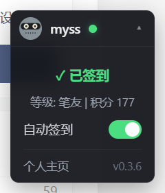

# linux.sb Suite

> Floating panel for [linux.sb](https://linux.sb/) (and `www.linux.bi`) with unread notifications, persisted panel position and theme, one-click daily check-in, and a settings popover.



## Install

1. Install the [Tampermonkey](https://www.tampermonkey.net/) extension.
2. 从 [Greasy Fork](https://greasyfork.org/en/scripts/590905-linux-sb-suite) 安装脚本（搜索 `linux.sb 助手` 或 `linux.sb Suite` 即可）。/ Install the script from [Greasy Fork](https://greasyfork.org/en/scripts/590905-linux-sb-suite) — search for `linux.sb 助手` or `linux.sb Suite`.
3. Open <https://linux.sb/> — a small pill appears in the bottom-right corner.

After install, Tampermonkey auto-updates the script from Greasy Fork using the script's built-in `@updateURL`.

## Features

### 1.1.3 (2026-08-12)

- `fix(user)`: capture rank + points from sidebar card; visitor avatar letter fallback.
- `fix(notif)`: user-scoped endpoint factory for `/user/<id>?tab=notifications`; auto-bust stale cache from 1.1.2.
- `feat(signin)`: auto-checkin via 5-minute poller with 20h dedupe window (persists across page loads).
- `test(fixtures)`: programmatic builders (`build-fixture.mjs`) so future fixture updates are one `node scripts/gen-fixtures.mjs` away.
- chore: drop legacy 
otif-unread-count reliance; new layout uses item list length as the unread count.

- **Always-visible status pill**: avatar + nickname + a colored dot that reflects the daily check-in state (green = signed in, yellow = not yet, gray = guest).
- **One-click sign-in**: expand the pill and tap `立即签到` if you have not signed in today.
- **Auto sign-in**: a switch in the expanded panel enables automatic check-in on every page load. Persisted in `GM_*`, no per-session confirmation.
- **Unread notifications**: a red dot on the pill shows unread count; expanding the panel shows the 5 most recent items. Polled every 60 s while the tab is visible, paused when the tab is hidden; falls back to 5 min polling after 3 consecutive errors.
- **Panel position & theme**: click the gear inside the panel to move it to any of the four corners and pick a light / dark / system-following palette. Choices persist via `GM_setValue`; new themes and positions are config-only edits.
- **Self-update**: Tampermonkey polls Greasy Fork's meta endpoint on its own schedule. New versions land with one click.

## Privacy

- No data leaves your browser except ordinary requests to `linux.sb` initiated by the script itself (the daily check-in POST and the notification poll).
- `GM_setValue` is used to remember your settings (position, theme, auto-signin) and a cached copy of your user info. These are stored locally by Tampermonkey and never sent anywhere.
- The script does not inject into iframes, does not touch any page outside `linux.sb` / `www.linux.bi`, and does not load any third-party resources at runtime.
- No mutation actions (mark-as-read, follow, like). The script is strictly read-only with respect to linux.sb to stay within Greasy Fork's policy.

## Architecture

```
LSB  (root namespace, the only global)
 +-- core/   always-loaded utilities
 |     config, logger, utils, storage, http, dom,
 |     i18n, settings, poller, palettes, css, dom-sections
 +-- api/    linuxSb  (selectors, URL patterns, response shape)
 +-- modules/   user, signin, panelStyle, notif, ui, debug
 +-- lib/    pure ESM, inlined into the public build by build.mjs
```

`core/settings` is the registry every module writes through — adding a new setting is one `LSB.settings.register({...})` call; the popover inside the panel renders the controls automatically. `core/poller` is the generic setInterval-with-visibility-pause-and-backoff primitive that any future background module reuses. `core/css` and `core/palettes` together make position and theme data-driven — the CSS rules for the panel are emitted from `config.ui.positions` and `core/palettes.mjs`, not hand-written. `core/i18n` provides a `LSB.t(key, locale?)` API; all user-visible strings go through it.

To add a feature, append a `LSB.register(...)` block at the bottom of `linux-sb-suite.user.js` (or, for pure logic, a `lib/*.mjs` file). Wire it to settings, sections, and the poller — the rest is automatic.

## Development

```bash
npm install

# Start a local file server on http://127.0.0.1:8123 serving the dev script.
node serve.mjs &

# Start Chrome with the debug port (Windows).
powershell -ExecutionPolicy Bypass -File start-chrome.ps1

# Drive Chrome via CDP.
node chrome-cdp.mjs list
node chrome-cdp.mjs eval "window.LSB.api.getCurrentUser()"

# After editing the dev script, push the update to your local TM install.
node chrome-cdp.mjs tm-update

# Run the unit tests (10 cases across core/ and lib/).
npm test
```

### Producing a public release

The repo keeps `linux-sb-suite.user.js` as the dev version (with a localhost `@updateURL` so the dev loop self-updates). `dist/linux-sb-suite.user.js` is the public artifact that ships to users.

`build.mjs` reads `.build-meta.json` and rewrites the public file's metadata: `@version`, `@author`, `@namespace`, `@description`, `@license`, plus the `@updateURL` / `@downloadURL` that point at Greasy Fork's auto-update endpoints. It also inlines `core/*.mjs` and `lib/*.mjs` so the resulting file is self-contained.

Release flow once a feature is ready:

1. Bump `version` in `.build-meta.json` (e.g. `1.1.0` → `1.2.0`).
2. `node build.mjs` regenerates `dist/linux-sb-suite.user.js` and mirrors the version into the runtime `LSB.version` constant.
3. `git add . && git commit && git push`.
4. Greasy Fork's script page already has a "Source code" sync configured against the GitHub raw URL (`https://raw.githubusercontent.com/vfhky/linux-sb-pro/main/dist/linux-sb-suite.user.js`) in auto mode. The new version is detected on the next sync tick.
5. Tampermonkey picks up the new meta from `@updateURL` on its own update check and offers the upgrade to installed users.

The dev script's `@version` is left at the in-progress dev number (e.g. `0.3.6`); only the public release version is bumped in step 1.

## License

Apache-2.0.

